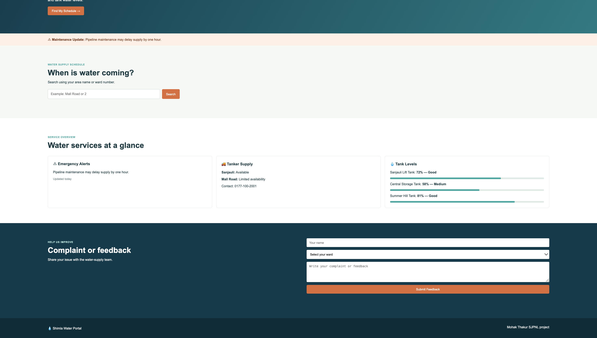
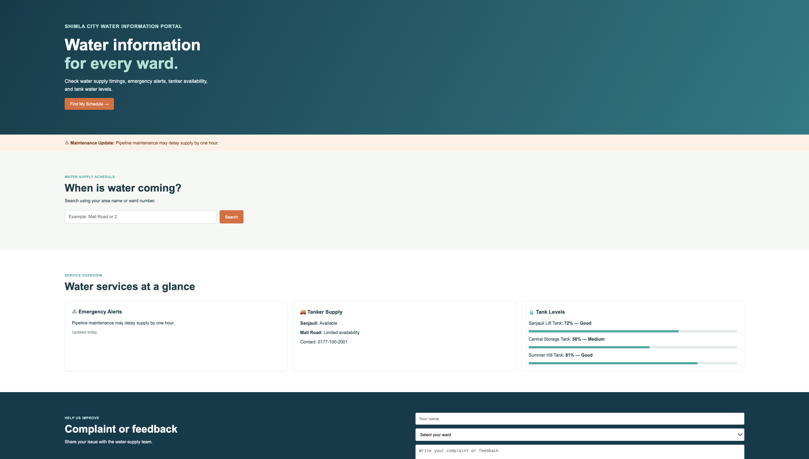
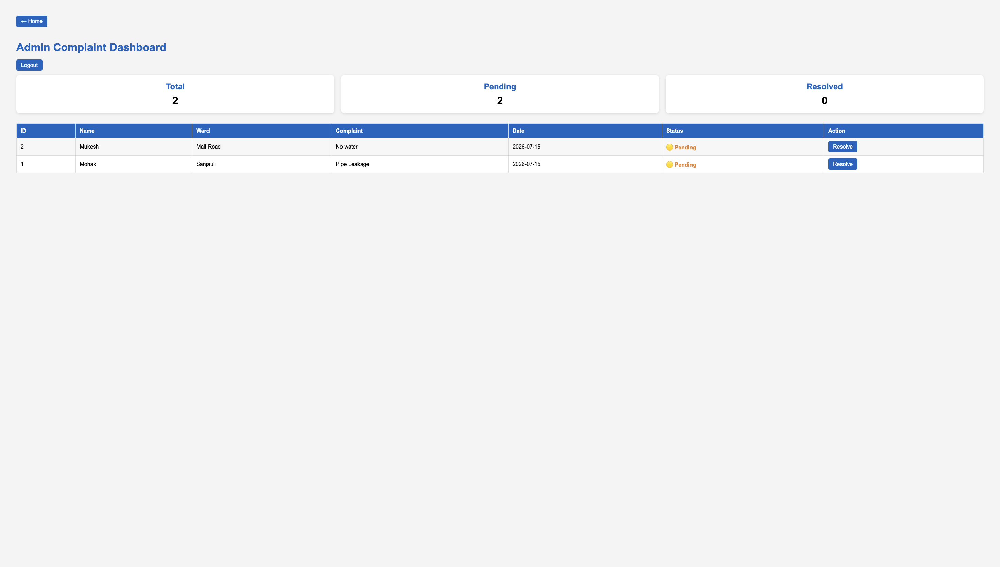

<div align="center">

# 💧 Smart Water Supply System

### Intelligent Water Distribution & Complaint Management Portal

A full-stack civic-tech application built using **Flask, SQLite, HTML, CSS, JavaScript, and C++** to help citizens monitor water supply schedules, water tank levels, maintenance alerts, and register complaints while allowing administrators to manage and resolve complaints through a secure dashboard.


</div>

---

# 🌐 Live Demo

### https://project-water-supply.onrender.com/

---

# 📖 Project Overview

The **Smart Water Supply System** is a civic-tech web application developed to improve communication between citizens and water supply authorities.

The platform enables residents to:

- 📅 Check ward-wise water supply schedules
- 💧 Monitor water tank levels
- 🚨 Receive maintenance alerts
- 📝 Register complaints online

Administrators have access to a secure dashboard where they can monitor, manage and resolve citizen complaints efficiently.

---

# ✨ Features

## 👨 Citizen Portal

- View ward-wise water supply schedules
- Search by ward number or locality
- Real-time water tank level display
- Automatic tank status using C++ integration
- Maintenance alert notifications
- Online complaint registration
- Responsive modern interface

---

## 🔐 Admin Dashboard

- Secure Login Authentication
- Complaint Dashboard
- View all complaints
- Complaint Statistics
- Mark complaints as **Resolved**
- Pending / Resolved Status Tracking
- Logout functionality

---

# 🛠 Technology Stack

| Category | Technology |
|-----------|------------|
| Backend | Flask |
| Database | SQLite |
| Frontend | HTML5, CSS3, JavaScript |
| Programming Language | Python |
| C++ Module | Tank Status Processing |
| Deployment | Render |

---

# ⚙ C++ Integration

Unlike traditional Flask projects, this application integrates a **C++ executable** with Python.

The compiled executable (`water_status`) processes tank water levels and returns their status.

Example:

| Tank Level | Status |
|------------|---------|
| 85% | Good |
| 60% | Medium |
| 20% | Low |

Python communicates with the executable using the **subprocess** module.

---

# 🗄 Database Schema

The application uses SQLite.

### Tables

- wards
- tanks
- complaints
- alerts

Complaint records store:

- Citizen Name
- Ward
- Complaint Description
- Submission Date
- Complaint Status

---

# 📂 Project Structure

```text
SmartWater
│
├── screenshots
│   ├── home.png
│   ├── feedback.png
│   └── Complaints.png
│
├── static
│   ├── style.css
│   └── script.js
│
├── templates
│   ├── index.html
│   ├── login.html
│   └── complaints.html
│
├── app.py
├── schema.sql
├── water_supply.cpp
├── water_status
├── build.sh
├── requirements.txt
└── README.md
```

---

# 🖼 Screenshots

## 🏠 Home Dashboard

Citizens can view water schedules, alerts, tanker information and live tank levels.

<p align="center">

</p>

---

## 📝 Complaint Registration

Residents can submit complaints directly through the portal.

<p align="center">

</p>

---

## 🔐 Admin Complaint Dashboard

Administrators can monitor complaints, view statistics and resolve complaints.

<p align="center">

</p>

---


# 🚀 Installation

Clone the repository

```bash
git clone https://github.com/YOUR_USERNAME/SmartWater.git
```

Move into the project directory

```bash
cd SmartWater
```

Install dependencies

```bash
pip install -r requirements.txt
```

Run the application

```bash
python app.py
```

Open in your browser

```
http://127.0.0.1:5000
```

---

# 📈 Future Enhancements

- Email Notifications
- SMS Alerts
- Live Water Tank Sensors
- GIS Ward Mapping
- PostgreSQL Integration
- Multi-Admin Authentication
- Complaint Image Upload
- Analytics Dashboard
- AI Complaint Categorization
- Mobile Application

---

# 🎯 Learning Outcomes

This project demonstrates practical implementation of:

- Flask Web Development
- SQLite Database Management
- CRUD Operations
- Session Authentication
- RESTful Routing
- HTML/CSS/JavaScript
- Python & C++ Integration
- Full Stack Development
- Deployment on Render
- Version Control using Git & GitHub

---

# 👨‍💻 Developer

## Mohak Thakur

**B.Tech Computer Science Engineering (Artificial Intelligence & Data Science)**

Jaypee University of Information Technology (JUIT)

Summer Internship Project • SJPNL Shimla • 2026

---

<div align="center">

### ⭐ If you found this project useful, please consider giving it a star!

Made with ❤️ by **Mohak Thakur**

</div>